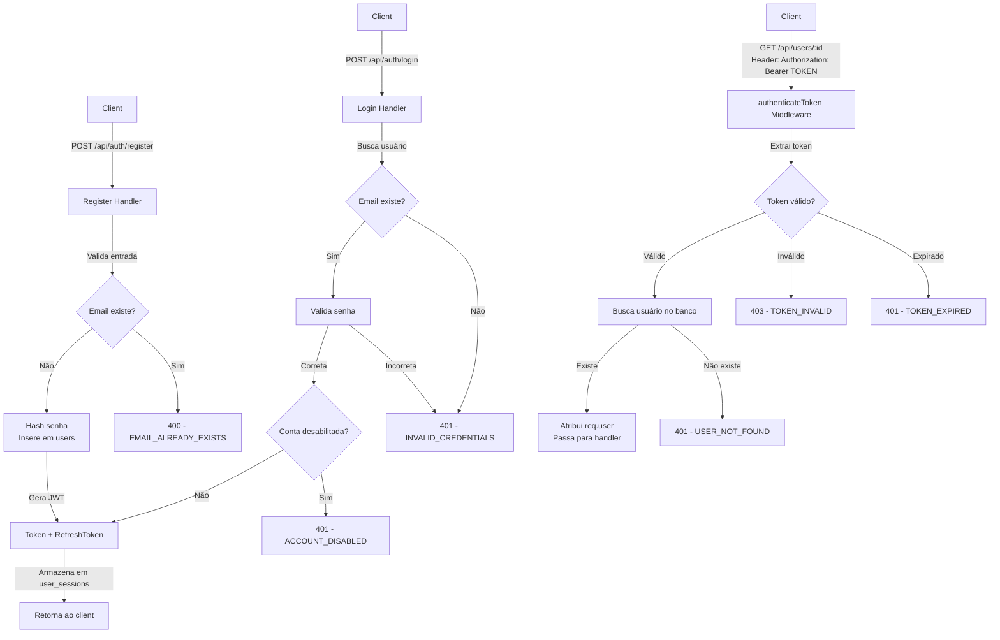

# 📋 Análise Estrutural do Projeto CurrículoJá

## 🗄️ ESTRUTURA DO BANCO DE DADOS

### Tabela: `users`
**Tipos de usuários:** `candidate`, `company`, `admin`, `school`

#### Colunas Principais:
| Coluna | Tipo | Default | Notas |
|--------|------|---------|-------|
| `id` | UUID | uuid_generate_v4() | Primary Key |
| `email` | VARCHAR(255) | - | UNIQUE NOT NULL |
| `password` | VARCHAR(255) | - | Hash bcrypt |
| `name` | VARCHAR(255) | - | Nome do usuário |
| `company_name` | VARCHAR(255) | - | Nome da empresa (para tipo 'company') |
| `phone` | VARCHAR(20) | - | Telefone |
| `cpf` | VARCHAR(14) | - | Para candidatos |
| `cnpj` | VARCHAR(18) | - | Para empresas |
| `type` | VARCHAR(20) | - | CHECK: candidate \| company \| admin \| school |
| `is_admin` | BOOLEAN | FALSE | Flag de administrador |
| `disabled` | BOOLEAN | FALSE | Desabilita a conta |
| `profile_image` | TEXT | - | Suporta base64 ou URLs |
| `bio` | TEXT | - | Biografia/descrição |

#### Colunas de Subscription/Planos:
| Coluna | Tipo | Default | Notas |
|--------|------|---------|-------|
| `subscription_plan` | VARCHAR(20) | 'free' | free \| premium \| etc |
| `subscription_status` | VARCHAR(20) | 'active' | active \| inactive \| etc |

#### Colunas de Verificação:
| Coluna | Tipo | Default | Notas |
|--------|------|---------|-------|
| `is_verified` | BOOLEAN | FALSE | ⚠️ Adicionada dinamicamente em jobs.js (linha 1246) |
| `is_agency` | BOOLEAN | FALSE | ⚠️ Adicionada dinamicamente (lazy migration) |

#### Colunas de Empresa (Dinâmicas):
| Coluna | Tipo | Notas |
|--------|------|-------|
| `company_sector` | VARCHAR(120) | Setor da empresa |
| `company_size` | VARCHAR(50) | Tamanho: pequena, média, grande, etc |
| `location` | VARCHAR(255) | Localização |

#### Colunas de Escola (Dinâmicas):
| Coluna | Tipo | Notas |
|--------|------|-------|
| `school_name` | VARCHAR(255) | Nome da escola |
| `school_type` | VARCHAR(100) | Tipo: pública, privada, etc |
| `school_address` | TEXT | Endereço completo |
| `school_city` | VARCHAR(100) | Cidade |
| `school_state` | VARCHAR(50) | Estado/UF |
| `school_cep` | VARCHAR(20) | CEP |
| `school_director` | VARCHAR(255) | Nome do diretor |
| `school_contact_phone` | VARCHAR(20) | Telefone |
| `school_website` | VARCHAR(255) | Site da escola |

#### Colunas de Redes Sociais (Dinâmicas):
| Coluna | Tipo | Notas |
|--------|------|-------|
| `linkedin_url` | - | Adicionada via PATCH |
| `instagram_url` | - | Adicionada via PATCH |
| `github_url` | - | Adicionada via PATCH |
| `custom_url` | - | URL customizada |
| `social_links` | JSONB | Formato JSON dos links sociais |
| `life_status` | - | Status de vida/profissional |
| `resume_sections` | - | Configuração de seções do CV |

#### Timestamps:
| Coluna | Tipo | Default |
|--------|------|---------|
| `created_at` | TIMESTAMP | CURRENT_TIMESTAMP |
| `updated_at` | TIMESTAMP | CURRENT_TIMESTAMP |

---

### Tabela: `jobs`
**Postagens de vagas pelas empresas**

| Coluna | Tipo | Notas |
|--------|------|-------|
| `id` | UUID | Primary Key |
| `company_id` | UUID | FK → users(id) ON DELETE CASCADE |
| `title` | VARCHAR(255) | NOT NULL |
| `description` | TEXT | NOT NULL |
| `requirements` | TEXT | - |
| `benefits` | TEXT | - |
| `salary_min` | DECIMAL(10,2) | - |
| `salary_max` | DECIMAL(10,2) | - |
| `salary_fixed` | DECIMAL(10,2) | - |
| `location` | VARCHAR(255) | - |
| `area` | VARCHAR(100) | Taxonomy de áreas |
| `subarea` | VARCHAR(100) | Taxonomy de sub-áreas |
| `work_type` | VARCHAR(50) | CHECK: presencial \| remoto \| hibrido |
| `contract_type` | VARCHAR(50) | CHECK: clt \| pj \| estagio \| temporario |
| `experience_level` | VARCHAR(50) | CHECK: junior \| pleno \| senior \| estagio |
| `is_active` | BOOLEAN | DEFAULT TRUE |
| `is_community` | BOOLEAN | DEFAULT FALSE |
| `featured` | BOOLEAN | DEFAULT FALSE |
| `applications_count` | INTEGER | DEFAULT 0 |
| `views_count` | INTEGER | DEFAULT 0 |
| `location_latitude` | DECIMAL(10,6) | - |
| `location_longitude` | DECIMAL(10,6) | - |
| `created_at` | TIMESTAMP | DEFAULT CURRENT_TIMESTAMP |
| `updated_at` | TIMESTAMP | DEFAULT CURRENT_TIMESTAMP |

---

### Tabela: `applications`
**Candidaturas para vagas**

| Coluna | Tipo | Notas |
|--------|------|-------|
| `id` | UUID | Primary Key |
| `job_id` | UUID | FK → jobs(id) ON DELETE SET NULL |
| `candidate_id` | UUID | FK → users(id) ON DELETE CASCADE |
| `resume_id` | UUID | FK → resumes(id) ON DELETE SET NULL |
| `cover_letter` | TEXT | Carta de apresentação |
| `status` | VARCHAR(50) | CHECK: pending \| reviewing \| interested \| interview \| approved \| rejected |
| `notes` | TEXT | Notas internas |

#### Campos de Entrevista (Dinâmicos - adicionados em applications.js):
| Coluna | Tipo | Notas |
|--------|------|-------|
| `interview_date` | TIMESTAMP | Data agendada |
| `interview_mode` | VARCHAR(20) | presencial \| remoto \| hibrido |
| `interview_location` | VARCHAR(200) | Local ou link |
| `interview_link` | TEXT | Link para entrevista remota |
| `interview_notes` | TEXT | Anotações |
| `interview_confirmed` | BOOLEAN | Confirmada |
| `interview_confirmed_at` | TIMESTAMP | Data da confirmação |
| `interview_rescheduled` | BOOLEAN | Remarcada |
| `interview_canceled_by_company` | BOOLEAN | Cancelada pela empresa |
| `interview_canceled_at` | TIMESTAMP | Data do cancelamento |
| `interview_rejected_by_candidate` | BOOLEAN | Rejeitada pelo candidato |
| `interview_rejected_at` | TIMESTAMP | Data da rejeição |
| `interview_cancel_reason` | TEXT | Motivo do cancelamento |
| `last_rejected_interview_date` | TIMESTAMP | Última rejeição |
| `final_approved` | BOOLEAN | Aprovado final |
| `final_approved_at` | TIMESTAMP | Data da aprovação final |
| `decision_feedback` | TEXT | Feedback final |
| `decision_by` | UUID | Quem tomou a decisão |
| `decision_at` | TIMESTAMP | Data da decisão |
| `updated_at` | TIMESTAMP | Atualização |

#### Constraints:
- UNIQUE(job_id, candidate_id) - Um candidato por vaga

---

### Tabela: `resumes`
**Currículos/Portfólios de usuários**

| Coluna | Tipo | Notas |
|--------|------|-------|
| `id` | UUID | Primary Key |
| `user_id` | UUID | FK → users(id) ON DELETE CASCADE |
| `title` | VARCHAR(255) | Título do CV |
| `template` | VARCHAR(50) | default \| [outros templates] |
| `is_public` | BOOLEAN | Visibilidade pública |
| `personal_info` | JSONB | Info pessoal estruturada |
| `experience` | JSONB | Experiências profissionais |
| `education` | JSONB | Educação |
| `skills` | JSONB | Habilidades |
| `languages` | JSONB | Idiomas |
| `projects` | JSONB | Projetos |
| `courses` | JSONB | Cursos |
| `file_hash` | VARCHAR(64) | Hash do arquivo para dedup |
| `deleted_at` | TIMESTAMP NULL | Soft delete |
| `created_at` | TIMESTAMP | - |
| `updated_at` | TIMESTAMP | - |

---

### Outras Tabelas Principais

#### `journey_progress` - Rastreamento do onboarding
- `user_id`, `step_id`, `completed`, `completed_at`, `data` (JSONB)

#### `user_sessions` - JWT refresh tokens
- `user_id`, `refresh_token`, `expires_at`

#### `activity_logs` - Auditoria
- `user_id`, `action`, `resource_type`, `resource_id`, `details` (JSONB), `ip_address`, `user_agent`, `created_at`

#### `school_classes` - Turmas escolares
- `school_id`, `class_name`, `grade`, `description`

#### `school_class_students` - Alunos por turma (Junction table)
- `class_id`, `student_id` (UNIQUE constraint)

#### Tabelas de Interação Social:
- `favorites` - Empresas salvando candidatos
- `company_follows` - Candidatos seguindo empresas
- `saved_jobs` - Candidatos salvando vagas
- `student_profile_views` - Rastreamento de visualizações
- `partnerships` - Parcerias escola-empresa

---

## 🔐 AUTENTICAÇÃO E AUTORIZAÇÃO

### Arquivo: `backend/middleware/auth.js`

#### Middlewares Disponíveis:

```javascript
// 1. authenticateToken
// - Valida JWT no header Authorization
// - Extrai userId do token
// - Verifica se usuário ainda existe no banco
// - Valida se conta está desabilitada
// - Retorna: req.user = { id, email, name, company_name, type, is_admin, disabled }

// 2. requireAdmin
// - Checa se req.user.type === 'admin' || req.user.is_admin
// - Retorna 403 se não for admin

// 3. requireCompany
// - Checa se req.user.type === 'company'
// - Retorna 403 se não for empresa

// 4. requireCandidate
// - Checa se req.user.type === 'candidate'
// - Retorna 403 se não for candidato

// 5. requireOwnerOrAdmin
// - Checa se é o próprio usuário (req.user.id === targetUserId)
// - OU se é admin
// - Usa params: userId ou id

// 6. optionalAuth
// - Tenta autenticar, mas continua se falhar
// - Útil para endpoints públicos com dados extras se autenticado
```

### Padrão JWT:
```javascript
{
  userId: uuid,
  email: string,
  type: 'candidate' | 'company' | 'admin' | 'school'
}
// Expiry: 7 dias
// Refresh token armazenado em user_sessions (30 dias)
```

---

## 🛣️ ESTRUTURA DE ROTAS

### Arquivo: `backend/server.js`

#### Padrão Geral:
```javascript
// 1. Importar express e rotas
import authRoutes from './routes/auth.js';
import userRoutes from './routes/users.js';
// ... etc

// 2. Registrar no app
app.use('/api/auth', authRoutes);
app.use('/api/users', userRoutes);
// ... etc
```

#### Rotas Implementadas (21 módulos):

| Rota | Arquivo | Descrição |
|------|---------|-----------|
| `/api/auth` | `routes/auth.js` | Login, registro, refresh token |
| `/api/users` | `routes/users.js` | Perfil, atualização, gestão |
| `/api/resumes` | `routes/resumes.js` | CRUD de currículos |
| `/api/jobs` | `routes/jobs.js` | CRUD de vagas |
| `/api/applications` | `routes/applications.js` | Candidaturas |
| `/api/favorites` | `routes/favorites.js` | Favoritos de empresa |
| `/api/interactions` | `routes/interactions.js` | Interações empresa-candidato |
| `/api/messages` | `routes/messages.js` | Mensagens diretas |
| `/api/chat` | `routes/chat.js` | Chat |
| `/api/schools` | `routes/schools.js` | Gestão de escolas |
| `/api/school-posts` | `routes/school-posts.js` | Posts de escolas |
| `/api/student-posts` | `routes/student-posts.js` | Posts de alunos |
| `/api/students` | `routes/student-profile-views.js` | Visualizações de perfil |
| `/api/social-feed` | `routes/social-feed.js` | Feed social |
| `/api/journey` | `routes/journey.js` | Onboarding/journey |
| `/api/job-alerts` | `routes/jobAlerts.js` | Alertas de vagas |
| `/api/saved-jobs` | `routes/savedJobs.js` | Vagas salvas |
| `/api/agency` | `routes/agency.js` | Agências de recrutamento |
| `/api/ai` | `routes/ai.js` | IA para análise de CVs |
| `/api/notifications` | `routes/notifications.js` | Sistema de notificações |
| `/api/external-jobs` | `routes/external-jobs.js` | Vagas externas |

#### Padrão de Rota (Exemplo de `jobs.js`):

```javascript
import express from 'express';
import { body, param, query, validationResult } from 'express-validator';
import pool from '../config/database.js';
import { authenticateToken, optionalAuth } from '../middleware/auth.js';

const router = express.Router();

// Lazy migration pattern (para backward compatibility)
let ensuredJobViews = false;
async function ensureJobViewsTable() {
  if (ensuredJobViews) return;
  try {
    await pool.query(`CREATE TABLE IF NOT EXISTS job_views (...)`);
    ensuredJobViews = true;
  } catch (e) {
    console.error('Erro:', e?.message || e);
  }
}

// GET - Listar
router.get('/', optionalAuth, async (req, res) => {
  try {
    // Validação com express-validator
    const errors = validationResult(req);
    if (!errors.isEmpty()) {
      return res.status(400).json({ errors: errors.array() });
    }
    
    // Lógica
    const result = await pool.query('SELECT * FROM jobs WHERE is_active = TRUE');
    res.json(result.rows);
  } catch (error) {
    console.error('Erro:', error);
    res.status(500).json({ error: 'Erro interno' });
  }
});

// GET - Um recurso
router.get('/:id', authenticateToken, async (req, res) => {
  // ...
});

// POST - Criar
router.post('/', authenticateToken, requireCompany, async (req, res) => {
  // ...
});

// PUT - Atualizar
router.put('/:id', authenticateToken, requireCompany, async (req, res) => {
  // ...
});

// DELETE - Deletar
router.delete('/:id', authenticateToken, requireCompany, async (req, res) => {
  // ...
});

export default router;
```

---

## 🏗️ PADRÕES ARQUITETURAIS

### 1. **Lazy Migration Pattern**
Usado para adicionar colunas dinamicamente sem corromper dados existentes:

```javascript
// Verificado uma só vez por execução
let ensuredColumn = false;
async function ensureColumn() {
  if (ensuredColumn) return;
  try {
    await pool.query(`ALTER TABLE users ADD COLUMN IF NOT EXISTS is_verified BOOLEAN DEFAULT FALSE`);
    ensuredColumn = true;
  } catch (e) {
    console.error('Erro:', e.message);
  }
}
```

**Usada em:**
- `is_agency` (users.js)
- `is_verified` (jobs.js)
- `company_sector`, `company_size` (users.js)
- Campos de entrevista (applications.js)

### 2. **Validação com express-validator**
```javascript
import { body, param, query, validationResult } from 'express-validator';

router.post('/', 
  body('email').isEmail(),
  body('password').isLength({ min: 6 }),
  body('type').isIn(['candidate', 'company', 'admin', 'school']),
  async (req, res) => {
    const errors = validationResult(req);
    if (!errors.isEmpty()) {
      return res.status(400).json({ errors: errors.array() });
    }
    // ...
  }
);
```

### 3. **Padrão de Erro Consistente**
```javascript
res.status(401).json({
  error: 'Mensagem de erro',
  code: 'ERRO_CODE', // Ex: TOKEN_EXPIRED, AUTH_REQUIRED
  details: {} // (opcional em development)
});
```

### 4. **Connection Pooling**
```javascript
import pool from '../config/database.js';

// Usando pool direto (queries curtas)
const result = await pool.query('SELECT * FROM users WHERE id = $1', [userId]);

// Usando client (transações)
const client = await pool.connect();
try {
  await client.query('BEGIN');
  await client.query('...');
  await client.query('COMMIT');
} catch (e) {
  await client.query('ROLLBACK');
} finally {
  client.release();
}
```

---

## 📊 COLUNAS RELACIONADAS A PLANOS/VERIFICAÇÃO

### Na Tabela `users`:
| Campo | Tipo | Padrão | Relacionado a |
|-------|------|--------|---------------|
| `subscription_plan` | VARCHAR(20) | 'free' | Planos de assinatura |
| `subscription_status` | VARCHAR(20) | 'active' | Status do plano |
| `is_verified` | BOOLEAN | FALSE | Verificação de empresa |
| `is_agency` | BOOLEAN | FALSE | Agência de recrutamento |

### Lógica de Verificação:
- **Arquivo**: `routes/jobs.js` (linha 1245-1269)
- **Query**: Adiciona `is_verified` e retorna status de verificação
- **Uso**: Diferencia empresas verificadas de não verificadas

### Lógica de Planos:
- **Arquivo**: `routes/jobs.js` (linha 93+)
- **Padrão Premium**: Todos têm acesso (verificação removida - comentário linha 27 de users.js)
- **Destaque de Vagas**: Via `job_company_highlights` table (se pagante)

---

## 🔄 FLUXO DE AUTENTICAÇÃO



---

## 📁 ESTRUTURA DE DIRETÓRIOS

```
backend/
├── server.js                          # Entrada principal
├── package.json                       # Dependências
├── config/
│   ├── database.js                   # Pool PostgreSQL
│   └── jobTaxonomy.js                # Taxonomia de áreas
├── middleware/
│   ├── auth.js                       # Autenticação (6 middlewares)
│   ├── upload.js                     # Upload de arquivos
│   └── validation.js                 # Validação de entrada
├── routes/                            # 21 módulos de rotas
│   ├── auth.js
│   ├── users.js
│   ├── resumes.js
│   ├── jobs.js
│   ├── applications.js
│   ├── ... (18 mais)
│   └── notifications.js
├── services/                          # Serviços auxiliares
│   ├── notificationService.js
│   └── matchingService.js
├── scripts/
│   ├── initDatabase.js               # Criação de tabelas
│   ├── seed.js                       # Dados iniciais
│   └── ... (múltiplas verificações)
├── db_init.sql                        # Schema completo (SQL puro)
└── uploads/                           # Arquivos enviados
```

---

## 🎯 RESUMO EXECUTIVO

### ✅ Implementado:
- **Autenticação**: JWT com 7 dias + Refresh token com 30 dias
- **Autorização**: 6 middlewares para diferentes roles
- **Banco de Dados**: PostgreSQL com 20+ tabelas
- **Validação**: express-validator em todas as rotas
- **Lazy Migration**: Backward compatibility com colunas dinâmicas
- **Planos**: `subscription_plan` e `subscription_status` implementados
- **Verificação**: `is_verified` para empresas
- **Rastreamento**: activity_logs para auditoria

### ⚠️ Pontos de Atenção:
1. Colunas são adicionadas dinamicamente (não em migrations formais)
2. `is_verified` é adicionado apenas em jobs.js, pode não estar em todas as tabelas
3. Planos não têm lógica de pagamento (apenas campos)
4. Sem middleware de rate-limit ou throttling
5. CORS configurado amplamente (permite development)

### 🚀 Próximos Passos Sugeridos:
1. Implementar sistema de pagamento para planos premium
2. Adicionar verificação formal de CNPJ/empresa
3. Criar migrations formais (não lazy)
4. Implementar rate-limiting
5. Adicionar logging estruturado (Winston/Pino)
