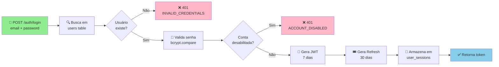

# 🗺️ ARQUITETURA VISUAL DO CURRÍCULOJÁ

## Diagrama 1: Fluxo de Autenticação



## Diagrama 2: Estrutura de Tabelas (Modelo ER Simplificado)

```
┌─────────────────────────────┐
│ USERS                       │
├─────────────────────────────┤
│ ⭐ id (PK)                  │
│ email                       │
│ password (bcrypt)           │
│ name (candidate)            │
│ company_name (company)      │
│ cnpj (company)              │
│ type: C|Co|A|S              │
│ subscription_plan           │
│ subscription_status         │
│ is_verified (dynamic)       │
│ is_agency (dynamic)         │
│ [school_*] (dynamic)        │
│ [company_*] (dynamic)       │
│ created_at, updated_at      │
└────────┬────────┬───────────┘
         │        │
         │        │ 1:N
      N:1│    ┌───┴──────────────────┐
         │    │                      │
┌─────────┴──────────┐      ┌────────┴─────────────┐
│ JOBS                │      │ RESUMES             │
├─────────────────────┤      ├─────────────────────┤
│ ⭐ id (PK)          │      │ ⭐ id (PK)          │
│ 🔗 company_id (FK)  │      │ 🔗 user_id (FK)     │
│ title               │      │ title               │
│ description         │      │ personal_info (JSONB)
│ salary_*            │      │ experience (JSONB)  │
│ location            │      │ education (JSONB)   │
│ area, subarea       │      │ skills (JSONB)      │
│ work_type           │      │ deleted_at (soft)   │
│ contract_type       │      │ file_hash           │
│ experience_level    │      └─────────────────────┘
│ is_active           │
│ featured            │              N:1
│ created_at          │                │
└────────┬────────────┘                │
         │                      ┌──────┴───────────────┐
         │ 1:N                  │ APPLICATIONS        │
         │            ┌─────────┤ ├─────────────────────┤
         │            │         │ ⭐ id (PK)          │
         │            │         │ 🔗 job_id (FK)      │
         │            │         │ 🔗 candidate_id(FK) │
         │            │         │ 🔗 resume_id (FK)   │
         │            │         │ status: pending...  │
         │            │         │ [interview_*] (dyn) │
         │            │         │ final_approved      │
         └────────────┘         │ created_at          │
                                └─────────────────────┘
```

## Diagrama 3: Estrutura de Autenticação (Middleware Chain)

```
Request
   │
   ▼
┌─────────────────────────────────────────────────┐
│ authenticateToken                               │
│ ├─ Extrai Bearer Token do header                │
│ ├─ jwt.verify() com JWT_SECRET                  │
│ ├─ Busca usuário no banco                       │
│ ├─ Valida se não está disabled                  │
│ └─ Atribui req.user = { id, email, type, ...} │
└──────────────┬──────────────────────────────────┘
               │
               ▼
      ┌─────────────────────┐
      │  Middleware Condicional?
      ├─ requireAdmin?      │
      ├─ requireCompany?    │
      ├─ requireCandidate?  │
      ├─ requireOwnerOrAdmin?
      └──────────┬──────────┘
                 │
                 ▼
         ┌──────────────────┐
         │  Route Handler   │
         │  (actual logic)  │
         └──────────────────┘
```

## Diagrama 4: Estrutura de Diretórios Backend

```
backend/
│
├─ 📄 server.js                 [ENTRADA PRINCIPAL]
│  ├─ Imports 21 rotas
│  ├─ Configura CORS, helmet, morgan
│  ├─ Registra middlewares globais
│  └─ Inicia em PORT (default 3001)
│
├─ 📁 config/
│  ├─ database.js              [Pool PostgreSQL]
│  └─ jobTaxonomy.js          [Enums de áreas]
│
├─ 📁 middleware/              [AUTENTICAÇÃO & VALIDAÇÃO]
│  ├─ auth.js                 [6 middlewares JWT]
│  ├─ upload.js               [Multer config]
│  └─ validation.js           [express-validator]
│
├─ 📁 routes/                  [21 MÓDULOS DE ROTAS]
│  ├─ auth.js                 [/api/auth]
│  ├─ users.js                [/api/users]
│  ├─ jobs.js                 [/api/jobs]
│  ├─ applications.js         [/api/applications]
│  ├─ resumes.js              [/api/resumes]
│  ├─ ... (16 mais)
│  └─ notifications.js        [/api/notifications]
│
├─ 📁 services/               [LÓGICA DE NEGÓCIO]
│  ├─ notificationService.js
│  └─ matchingService.js
│
├─ 📁 scripts/                [SETUP & MIGRATION]
│  ├─ initDatabase.js         [Cria tabelas]
│  ├─ seed.js                 [Dados iniciais]
│  └─ check-*.js              [Verificações]
│
├─ 📄 db_init.sql             [SCHEMA COMPLETO]
│
├─ 📁 uploads/                [ARQUIVOS ENVIADOS]
│
├─ 📁 templates/              [PLANILHAS/MODELOS]
│
├─ 📄 package.json            [DEPENDÊNCIAS]
│
├─ 📄 .env                     [VARIÁVEIS SECRETAS]
│
└─ 📄 .gitignore

VARIÁVEIS .ENV CRÍTICAS:
├─ DB_HOST, DB_PORT, DB_NAME, DB_USER, DB_PASSWORD
├─ JWT_SECRET
├─ NODE_ENV (development|production)
├─ PORT (default 3001)
├─ FRONTEND_URL
└─ ALLOWED_ORIGINS
```

## Diagrama 5: Padrão de Rota (Exemplo jobs.js)

```
┌─────────────────────────────────────────────────────┐
│ routes/jobs.js - Padrão Interno                     │
├─────────────────────────────────────────────────────┤
│                                                     │
│  1️⃣  Imports                                       │
│     ├─ express                                      │
│     ├─ express-validator                           │
│     ├─ pool (database)                            │
│     └─ middlewares (authenticateToken, etc)       │
│                                                     │
│  2️⃣  Router                                        │
│     router = express.Router()                      │
│                                                     │
│  3️⃣  Lazy Migrations (opcional)                    │
│     ├─ if (!ensured) { ALTER TABLE ADD COLUMN }   │
│     └─ set ensured = true                         │
│                                                     │
│  4️⃣  GET Routes                                    │
│     ├─ GET /       [optionalAuth]                  │
│     ├─ GET /:id    [optionalAuth]                  │
│     └─ GET /company/:id [authenticateToken]       │
│                                                     │
│  5️⃣  POST Routes                                   │
│     POST / [authenticateToken, requireCompany]    │
│     ├─ body validation                            │
│     ├─ INSERT INTO jobs                           │
│     └─ return 201 CREATED                         │
│                                                     │
│  6️⃣  PUT Routes                                    │
│     PUT /:id [authenticateToken, requireCompany]  │
│     ├─ Valida ownership (company_id === user.id)  │
│     └─ UPDATE jobs                                │
│                                                     │
│  7️⃣  DELETE Routes                                 │
│     DELETE /:id [authenticateToken, requireCo]   │
│     └─ Marca como inativa ou DELETE               │
│                                                     │
│  8️⃣  Export                                        │
│     export default router;                        │
│                                                     │
└─────────────────────────────────────────────────────┘

                           ▼
                  server.js registra:
             app.use('/api/jobs', jobRoutes)
```

## Diagrama 6: Fluxo de Dados - Criar Vaga (POST /api/jobs)

```
┌──────────────────────────────────────────────────────────────────┐
│ CLIENT: POST /api/jobs                                           │
│ {                                                                │
│   "title": "Dev Senior",                                        │
│   "description": "...",                                         │
│   "salary_min": 8000,                                           │
│   "salary_max": 12000,                                          │
│   "work_type": "remoto",                                        │
│   "contract_type": "clt"                                        │
│ }                                                                │
│ Header: Authorization: Bearer <JWT_TOKEN>                       │
└──────────────┬───────────────────────────────────────────────────┘
               │
               ▼
┌──────────────────────────────────────────────────────────────────┐
│ server.js - CORS & Middlewares                                   │
│ ├─ helmet() - Security headers                                   │
│ ├─ cors() - Allow origin                                         │
│ ├─ morgan() - Logging                                            │
│ ├─ express.json() - Parse body                                   │
│ └─ Passa para rota                                               │
└──────────────┬───────────────────────────────────────────────────┘
               │
               ▼
┌──────────────────────────────────────────────────────────────────┐
│ routes/jobs.js - POST Handler                                    │
│ ├─ authenticateToken Middleware                                  │
│ │  ├─ Extrai token do header                                    │
│ │  ├─ Decodifica JWT                                            │
│ │  ├─ Busca usuário em DB                                       │
│ │  └─ req.user = { id, email, type, ... }                       │
│ │                                                                │
│ ├─ requireCompany Middleware                                     │
│ │  ├─ Valida req.user.type === 'company'                        │
│ │  └─ Retorna 403 se não for empresa                            │
│ │                                                                │
│ ├─ express-validator                                            │
│ │  ├─ body('title').notEmpty()                                  │
│ │  ├─ body('description').notEmpty()                            │
│ │  └─ Coleta erros se houver                                    │
│ │                                                                │
│ └─ Handler Function                                              │
│    ├─ Valida errors = validationResult(req)                     │
│    ├─ pool.query(INSERT INTO jobs...)                           │
│    │  VALUES(req.user.id, req.body.title, ...)                 │
│    └─ Retorna 201 com job criado                                │
└──────────────┬───────────────────────────────────────────────────┘
               │
               ▼
┌──────────────────────────────────────────────────────────────────┐
│ DATABASE: INSERT INTO jobs                                       │
│ (id, company_id, title, description, salary_min, ...)          │
│ VALUES (uuid(), '<user.id>', 'Dev Senior', ..., 8000, ...)     │
│                                                                  │
│ TRIGGERS:                                                        │
│ ├─ update_updated_at_column → updated_at = NOW()               │
│ └─ (optional) Notificações para escola parceira                │
└──────────────┬───────────────────────────────────────────────────┘
               │
               ▼
┌──────────────────────────────────────────────────────────────────┐
│ RESPONSE: 201 CREATED                                            │
│ {                                                                │
│   "id": "uuid-xxxxx",                                           │
│   "company_id": "uuid-empresa",                                 │
│   "title": "Dev Senior",                                        │
│   "description": "...",                                         │
│   "salary_min": 8000,                                           │
│   "salary_max": 12000,                                          │
│   "is_active": true,                                            │
│   "created_at": "2025-07-06T10:30:00Z",                         │
│   "updated_at": "2025-07-06T10:30:00Z"                          │
│ }                                                                │
└──────────────────────────────────────────────────────────────────┘
```

## Diagrama 7: Relações de Tabelas (Completo)

```
                          ┌─────────────────┐
                          │     USERS       │
                          │ (20+ colunas)   │
                          │  type C|Co|A|S  │
                          └────────┬────────┘
                    ┌───────────────┼───────────────┐
                    │               │               │
              1:N   │          1:N  │          1:N  │
                    │               │               │
        ┌───────────▼─────────┐  ┌──▼───────────────┐  ┌──────────────▼───────┐
        │ JOBS                │  │ RESUMES          │  │ JOURNEY_PROGRESS     │
        │ (company's posts)   │  │ (user's CVs)     │  │ (onboarding steps)   │
        └────────┬────────────┘  └──┬───────────────┘  └──────────────────────┘
                 │                  │
            1:N  │              N:1 │
                 │                  │
        ┌────────▼──────────────────▼──────────┐
        │ APPLICATIONS                         │
        │ (candidate applies to job)           │
        │ status: pending|reviewing|...|reject│
        │ [interview_* fields]                 │
        └──────────────────────────────────────┘

RELACIONADAS A COMPANIES (type='company' in users):

    users(company)
         │
         ├─ N:1──► jobs (job_id FK)
         │
         ├─ N:1──► favorites (company_id FK) ◄─── users(candidate)
         │
         ├─ N:1──► partnerships (company_id FK) ◄─── users(school)
         │
         └─ N:1──► student_profile_views (company_id FK) ◄─── users(candidate)

RELACIONADAS A CANDIDATES (type='candidate' in users):

    users(candidate)
         │
         ├─ N:1──► resumes (user_id FK)
         │
         ├─ N:1──► applications (candidate_id FK)
         │
         ├─ N:1──► saved_jobs (candidate_id FK) ◄─── jobs
         │
         ├─ N:1──► company_follows (candidate_id FK) ◄─── users(company)
         │
         └─ N:1──► student_profile_views (student_id FK) ◄─── users(company)

RELACIONADAS A SCHOOLS (type='school' in users):

    users(school)
         │
         ├─ N:1──► school_classes (school_id FK)
         │         │
         │         └─ N:1──► school_class_students ◄─── users(candidate)
         │
         └─ N:1──► partnerships (school_id FK) ◄─── users(company)
```

---

## 📊 Status da Implementação

| Feature | Status | Nota |
|---------|--------|------|
| **Autenticação** | ✅ Completo | JWT + Refresh |
| **Autorização** | ✅ Completo | 6 middlewares |
| **CRUD Usuários** | ✅ Completo | Todos os tipos |
| **CRUD Vagas** | ✅ Completo | Com destaque |
| **CRUD Candidaturas** | ✅ Completo | Com campos entrevista |
| **Favoritos/Saved** | ✅ Completo | Multiplataforma |
| **Mensagens** | ✅ Completo | Direct messages |
| **Planos** | ⚠️ Parcial | Colunas sem lógica |
| **Verificação** | ⚠️ Parcial | Coluna sem validação |
| **Pagamentos** | ❌ Não existe | Não implementado |
| **IA Analysis** | ✅ Existe | `/api/ai` |
| **Notificações** | ✅ Existe | `/api/notifications` |

